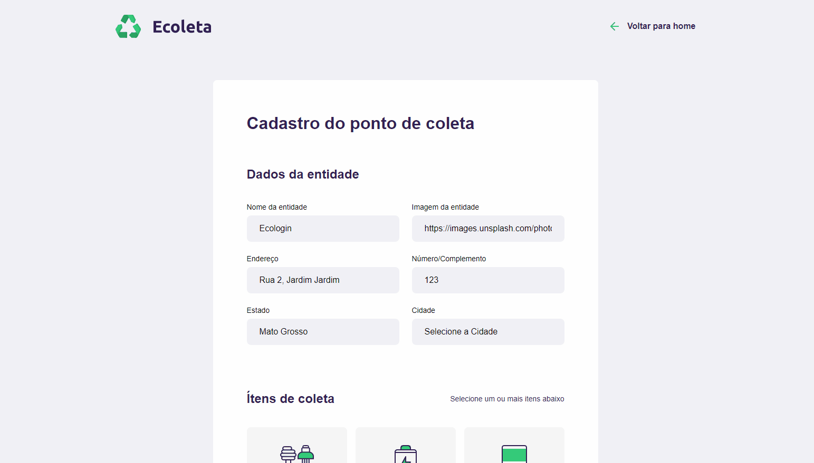
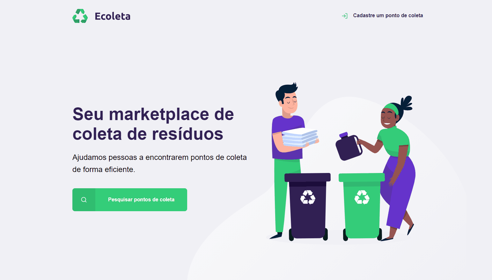

<h2 align="center">
Ecoleta - Marketplace de coleta de resíduos
</h2>

  

<h3 align="center">  
  <a href="#information_source-sobre">Sobre</a> |
  <a href="#interrobang-motivo">Motivo</a> | 
  <a href="#rocket-tecnologias-utilizadas">Tecnologias</a> | 
  <a href="#licença">Licença</a> 
</h3>

## :information_source: Sobre

Marketplace voltado para sustentabilidade, onde empresas cadastram seus pontos de coleta de resíduos nocivos ao meio ambiente e pessoas encontram pontos de coleta.

## :interrobang: Motivo

O projeto foi realizado juntamente com a orientação do professor Mayk Brito na primeira semana do Next Level Week, com intuito de aprendizado de novas tecnologias e eco sistemas.

## :rocket: Tecnologias Utilizadas

O projeto foi desenvolvido utilizando as seguintes tecnologias

- HTML
- CSS
- Node.js
- Express Framework
- Nunjucks template engine
- Javascript
- SQL
- sqlite3
- nodemon
